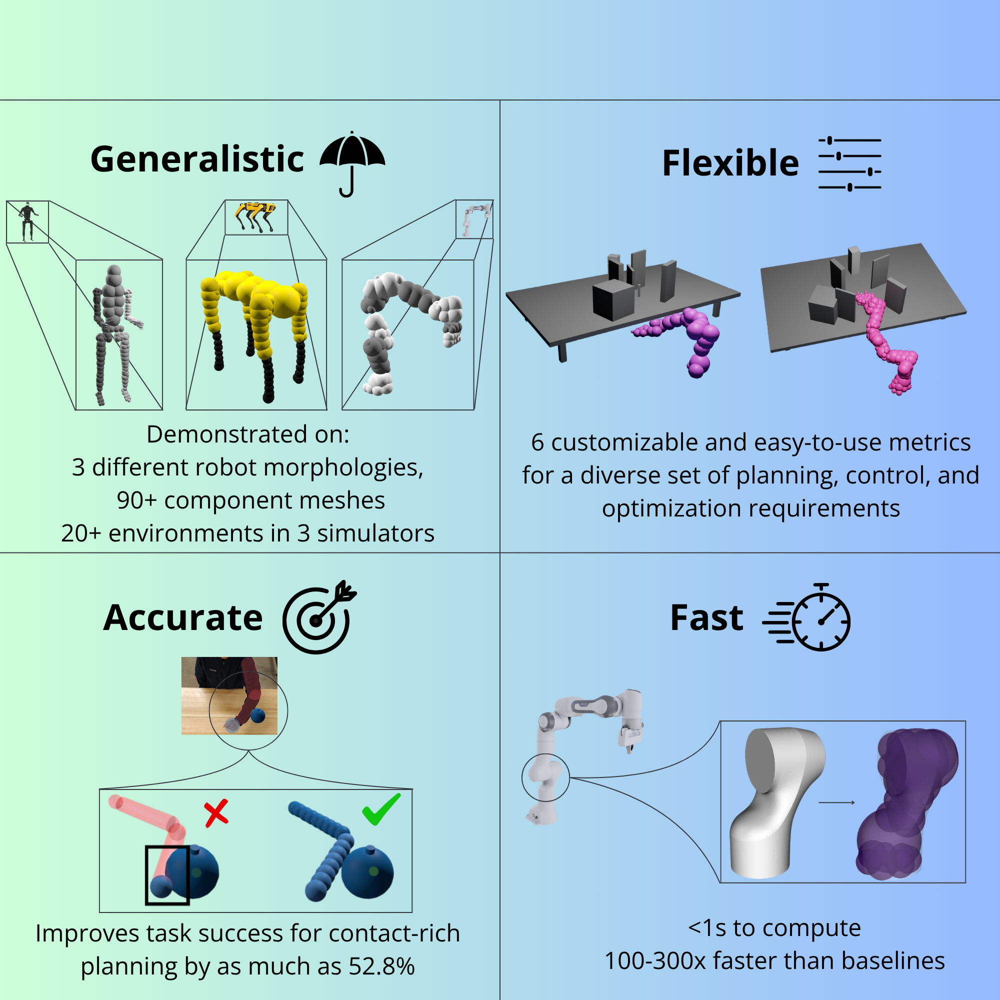

# MorphIt: Flexible Spherical Approximation of Robot Morphology




MorphIt is a novel algorithm for approximating robot morphology using spherical primitives that balances geometric accuracy with computational efficiency. Unlike existing approaches that rely on either labor-intensive manual specification or inflexible computational methods, MorphIt implements an automatic gradient-based optimization framework with tunable parameters that provides explicit control over the physical fidelity versus computational cost tradeoff.

## Key Features

- **Automatic spherical approximation** of any robot mesh with gradient-based optimization
- **Flexible configuration** with three variants (MorphIt-V, MorphIt-S, MorphIt-B) for different task requirements
- **Fast computation** - up to 2 orders of magnitude faster than baseline methods
- **Superior accuracy** - better mesh approximation with fewer spheres
- **Seamless integration** - generates URDF files compatible with popular robotics simulators


## Quick Start

### Setup Environment
```bash
uv venv venv-morphit --python 3.10
source venv-morphit/bin/activate
uv pip install -r requirements.txt
```

### Compile Helper Module
Compile an efficient helper module used to check whether a point lies inside a mesh:
```bash
cd src
python setup.py build_ext --inplace
```
This should generate a file such as `triangle_hash.cpython-310-x86_64-linux-gnu.so`

### Run Tests
Test the system to ensure everything is working:
```bash
cd src
python test_morphit.py
```
This runs some tests including imports, configuration, model creation, loss computation, and minimal training to verify the installation.

### Run Example
```bash
cd src
python main.py
```

## Usage

### Basic Usage
```python
from morphit import MorphIt
from config import get_config

# Create configuration
config = get_config("MorphIt-B")  # Balanced configuration
config.model.mesh_path = "path/to/your/mesh.obj"
config.model.num_spheres = 15

# Create and train model
model = MorphIt(config)
tracker = model.train()

# Save results
model.save_results("output.json")
```

### Batch Processing
Process multiple mesh files:
```bash
cd src
python morphit_panda.py
```

### Visualization
Visualize sphere packing results:
```bash
cd src
python visualize_packing.py results/output/morphit_results.json
```

## File Overview

### Core System
- `morphit.py` - Main MorphIt class implementing the spherical approximation algorithm
- `config.py` - Configuration management with predefined variants (V, S, B)
- `losses.py` - Loss functions for optimization (coverage, overlap, boundary, surface, containment, SQEM)
- `training.py` - Training loop and optimization logic
- `density_control.py` - Adaptive sphere pruning and addition mechanisms

### Utilities
- `inside_mesh.py` - Efficient mesh containment checking using Cython
- `visualization.py` - PyVista-based visualization functions
- `convergence_tracker.py` - Training metrics tracking and analysis
- `logger.py` - Evolution logging and rendering thread management

### Scripts
- `main.py` - Main example script
- `test_morphit.py` - Comprehensive system tests
- `morphit_panda.py` - Batch processing for Franka Panda robot
- `visualize_packing.py` - Standalone visualization tool
- `scripts/` - URDF generation and integration scripts for Drake, CuRobo

### Build Files
- `setup.py` - Cython compilation setup
- `triangle_hash.pyx` - Cython implementation for fast mesh queries
- `triangle_hash.cpp` - Generated C++ code

## Configuration Variants

- **MorphIt-V**: Volume-focused, conservative approximations for collision avoidance
- **MorphIt-S**: Surface-focused, precise approximations for contact-rich manipulation
- **MorphIt-B**: Balanced approximation for general-purpose applications

## Applications

- Collision detection and avoidance
- Contact-rich manipulation planning
- Navigation through cluttered spaces
- Whole-body contact planning
- Real-time motion generation

## System Requirements

- Ubuntu 22.04.5 LTS (recommended)
- Python 3.10
- CUDA-capable GPU (optional, for acceleration)

## Citation

If you use MorphIt in your research, please cite our paper:
```
[Paper citation will be added upon publication]
```

## License

This project is licensed under the MIT License - see the [LICENSE](LICENSE) file for details.